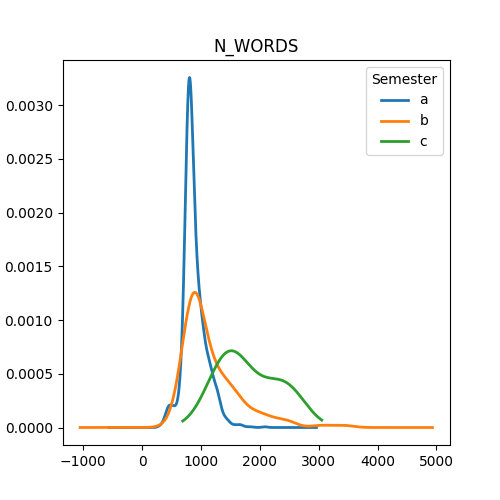

# Assingment 1

## important
First: run setup/create_venv.sh to create a visual environment
Second: activate it (from the setup folder) source ../Language_venv/bin/activate
Third:  run the setup.sh to install necessary packages.

In case it is not working the full list of used packages and version can be viewed in setup/requirements.txt

# Extracting linguistic features using spaCy

This assignment concerns using ```spaCy``` to extract linguistic information from a corpus of texts.

The corpus is an interesting one: *The Uppsala Student English Corpus (USE)*. All of the data is included in the folder called ```in``` but you can access more documentation via [this link](https://ota.bodleian.ox.ac.uk/repository/xmlui/handle/20.500.12024/2457).

For this exercise, you should write some code which does the following:

- Loop over each text file in the folder called ```in```
- Extract the following information:
    - Relative frequency of Nouns, Verbs, Adjective, and Adverbs per 10,000 words
    - Total number of *unique* PER, LOC, ORGS
- For each sub-folder (a1, a2, a3, ...) save a table which shows the following information:

|Filename|RelFreq NOUN|RelFreq VERB|RelFreq ADJ|RelFreq ADV|Unique PER|Unique LOC|Unique ORG|
|---|---|---|---|---|---|---|---|
|file1.txt|---|---|---|---|---|---|---|
|file2.txt|---|---|---|---|---|---|---|
|etc|---|---|---|---|---|---|---|

## Objective

This assignment is designed to test that you can:

1. Work with multiple input data arranged hierarchically in folders;
2. Use ```spaCy``` to extract linguistic information from text data;
3. Save those results in a clear way which can be shared or used for future analysis

## Some notes

- The data is arranged in various subfolders related to their content (see the associate README for more info). You'll need to think a little bit about how to do this. You should be able do it using a combination of things we've already looked at, such as ```os.listdir()```, ```os.path.join()```, and for loops.
- The text files contain some extra information that such as document ID and other metadata that occurs between pointed brackets ```<>```. Make sure to remove these as part of your preprocessing steps!
- There are 14 subfolders (a1, a2, a3, etc), so when completed the folder ```out``` should have 14 CSV files.

## Additional comments

Your code should include functions that you have written wherever possible. Try to break your code down into smaller self-contained parts, rather than having it as one long set of instructions.

For this assignment, you are welcome to submit your code either as a Jupyter Notebook, or as ```.py``` script. If you do not know how to write ```.py``` scripts, don't worry - we're working towards that!

Lastly, you are welcome to edit this README file to contain whatever informatio you like. Remember - documentation is important!

##############################################################################

# 3. Structure
## in/ 
folder with subfolders with data e.g.: "in/a_1/text_1.txt ... in/a_1/text_n.txt"
                                       "in/n_1/text_1.txt ... in/n_1/text_n.txt"

## out/
folder with .csv files of the results
## plots/
a few plots for a a short analysis of the data
## src/
### b_func.py
custom functions for the analysis:
- for more detailed descriptions see b_func:

### a_1.py
The script is based on the count_one_file_one_folder() function.
It reads a single text file, and runs the model ```en_core_web_md``` https://spacy.io/models/en#en_core_web_md to identify word classes and parts of speech.

It is a medium sized model (20k unique vectors) trained on english web data.

The sought after values are:
- Nouns
- Verbs
- Adverbs
- Adjectives
------------
- Names
- Locations
- Organizations

These are then counted and stored in a dictionary format.
The other functions count_many_files_one_folder(), count_many_files_many_folders() do the same just on increasingly larger structures based on each other.


- analysis()
creates a few plots regarding how the writing of students in the data changes over time.
# 4 small analyisis 
In the data "a" essays are produced in the first term, "b" in the second, "c" in the third.

Some interesting findings from plotting the data by different semesters.
These are only based on looking at plots, more in depth results could be achieved by statistical models. 

- Number of words

As time passes some difference can be seen in the length of essays. Semester "C" is clearly a different distribution, but the elongated tail of "b" also suggests, that as time passes students produce longer written texts.

In the same fashion, students seem to write more about People as the semesters pass.


To me was surprising to see the frequency of adjectives drop by semester "c". 
My intuition is that adjectives usually describe and decorate actions, objects, subjects, etc. and as the speaker becomes more and more proficient, their language use should become more colorful and vivid. Especially considering the large increase in People being mentioned in those essays, it seems they are only being mentioned but not described. Maybe semester "c" essays are more report focused rather then opinion based? It seems logical, that an impartial, objective assessment of historical or political events would contain less adjectives, than something subjective and opinion based.


It is important to note the data is imbalanced, there are less data from semester "c", than the other two, which could influence findings.

The exact criteria for the essays is also not investigated. For example semester "c" papers might not be longer because students became more proficient in English, maybe the required minimal word count was simply higher for those, so students had to write more. Or semester "c" essays might have more People mentioned, because the topic of the essays were People, so students were forced to name more.


# X. Assignment 5 
To read more on possible carbon emission due to running the project, see assignment5


