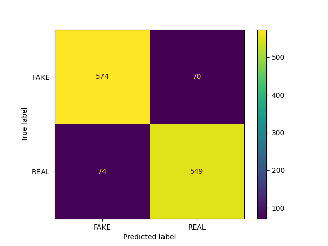

## important
First: run setup/create_venv.sh to create a visual environment
Second: activate it (from the setup folder) source ../Language_venv/bin/activate
Third:  run the setup.sh to install necessary packages.

In case it is not working the full list of used packages and version can be viewed in setup/requirements.txt

# Assignment 2 - Text classification benchmarks

This assignment is about using ```scikit-learn``` to train simple (binary) classification models on text data. For this assignment, we'll continue to use the Fake News Dataset that we've been working on in class.

For this exercise, you should write *two different notebooks*. One script should train a logistic regression classifier on the data; the second notebook should train a neural network on the same dataset. Both notebooks should do the following:

- Save the classification report to a text file the folder called ```out```
- Save the trained models and vectorizers to the folder called ```models```

## Objective

This assignment is designed to test that you can:

1. Train simple benchmark machine learning classifiers on structured text data;
2. Produce understandable outputs and trained models which can be reused;
3. Save those results in a clear way which can be shared or used for future analysis

## Some notes

- Saving the classification report to a text file can be a little tricky. You will need to Google this part!
- You might want to challenge yourself to create a third script which vectorizes the data separately, and saves the new feature extracted dataset. That way, you only have to vectorize the data once in total, instead of once per script. Performance boost!

## Additional comments

Your code should include functions that you have written wherever possible. Try to break your code down into smaller self-contained parts, rather than having it as one long set of instructions.

For this assignment, you are welcome to submit your code either as a Jupyter Notebook, or as ```.py``` script. If you do not know how to write ```.py``` scripts, don't worry - we're working towards that!

Lastly, you are welcome to edit this README file to contain whatever information you like. Remember - documentation is important.

################################################################
# DATA 
- the data folder should have the appropriate .csv file, : data/fake_or_real_news.csv
https://www.kaggle.com/datasets/jillanisofttech/fake-or-real-news

## Structure

- data: the folder for the data
- models: output models for the logistic regression and neural network classifier, there's only 1 vectoriser, as the same one was used for processing before both models.
- out: classification reports and confusion matrices of test data
- src:
    - b_func: useful functions,
    - log_reg.py: the code for the logistic regression classifier
    - nn.py: the code for the neural network classifier

## Code

- log_reg.py:
    data is loaded and separated into test and train splits. the preprocDF() function could also vectorize it, but for the sake of Assingment5 and separating processes as much as possible, the vectorization is done after.
    The vectorizer is a Term Frequency Inverese Document Frequency Vectoriser. It works on the principle of creating numeric representations of words based on how many times they appear in the document compared to how many times they appear in the entire corpus.
    read more: https://scikit-learn.org/stable/modules/generated/sklearn.feature_extraction.text.TfidfVectorizer.html

    The arguments added are: 
    - ngram_range=(1,2), so it identifies unigrams and bigrams for the sake of trying to keep coherent epxpressions together
    - lowercase = True, so the character are lowercased before tokenization to deal with word at the beginning of sentences 
    - max_df = .95, and min_df = .05, so the top and lower 5% of words are discarded, because very common and very uncommon words could hinder classification
    - max_features = 500 So documents are represented as a numeric vector of length 500. The tf-idf of 500 words should be enough for the classifier.

    The classifier is a default Logistic Regression classifier.
    https://scikit-learn.org/stable/modules/generated/sklearn.linear_model.LogisticRegression.html

    Then metrices of evaulating performance are produced and saved along with the model

- nn.py:
    Essentially the same, but the classifier used is a Neural Network Classifier:
    https://scikit-learn.org/stable/modules/generated/sklearn.neural_network.MLPClassifier.html

    The activation function is "logistic", as it is easier to compare to a logistic regression classifier this way, since it is now basically multiple logistic regressions working together.

    hidden_layer_sizes=(20,) was set to reduce runtime.

    After some trial and error pokes and failing to significantly increase performance without increasing runtime exponentially, other values were left at default.

## Results:
- logistic regression classifier:

Classification Report

              precision    recall  f1-score   support

        FAKE       0.89      0.89      0.89       644
        REAL       0.89      0.88      0.88       623

    accuracy                           0.89      1267
   macro avg       0.89      0.89      0.89      1267
weighted avg       0.89      0.89      0.89      1267



It generally performs well on the test data, precision and recall are quite consistent.
It seems slightly better at classifying Fake data.

- Neural Network Classifier

Classification report

              precision    recall  f1-score   support

        FAKE       0.89      0.91      0.90       644
        REAL       0.90      0.88      0.89       623

    accuracy                           0.90      1267
   macro avg       0.90      0.90      0.90      1267
weighted avg       0.90      0.90      0.90      1267


Scores show a slight increase. More hidden layers might increase it further, but run duration would also be longer.

The neural network performs better, but not by much. At the cost of increased runtime, energy consumption and thus co2 emissions it might be honed further, but the logistic regression classifier does quite well already, and therefore I decided these results are satisfactiory to me.

# X. Assignment 5 
To read more on possible carbon emission due to running the project, see assignment5

