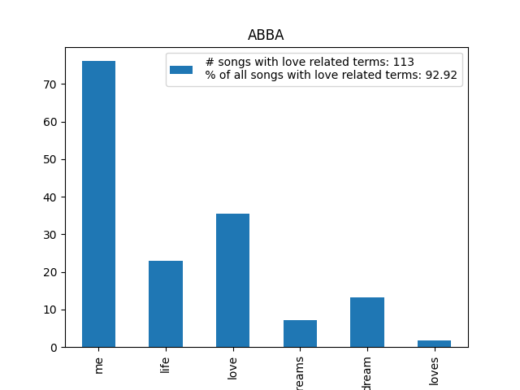

## important
before running any of the code run ../setup/setup.sh to load necessary packages.
'
# Assignment 3 - Query expansion with word embeddings

Have you ever wondered which of your favourite pop stars sing most about "love"? I bet you have.

In this assignment, we're going to be working with a corpus of lyrics from 57,650 English-language songs. You can find a link to the dataset [here](https://www.kaggle.com/datasets/joebeachcapital/57651-spotify-songs). It's also available on UCloud.

At the beginning of the semester, we saw how we could search for individual keywords and count how frequently they appear in a text. In this assignment, we're going to do some ```query expansion``` with word embeddings via ```gensim```. This means we choose a target word, find the most similar words to this target keyword, and then search for *all of those words* in our texts. Instead of just looking for the word "love", we'll be looking for this word and other related words - expanding our query to include a wider range of related words. 

You should write a script which does the following:

- Loads the song lyric data
- Downloads/loads a word embedding model via ```gensim``` (see below)
- Takes a given word as an input and finds the most similar words via word embeddings
- Find how many songs for a given artist feature terms from the expanded query
- Calculate the percentage of that artist's songs featuring those terms
- Print and/or save results in an easy-to-understand way
    - For example, "45% of {ARTIST}'s songs contain words related to {SEARCH TERM}"

## Starter coder

For convenience, I recommend using a small, pretrained model from ```gensim``` like the following. However, this is by no means compulsory - feel free to use a different model if you so wish!

```python
import gensim.downloader as api
model = api.load("glove-wiki-gigaword-50")
```

## Objective

This assignment is designed to test that you can:

1. Pre-process texts in sensible ways;
2. Use pretrained word embeddings for query expansion;
3. Create a resusable command line tool for calculating results based on user inputs.

## Some notes

- You'll need to use ```argparse``` in this code, and I'd recommend structuring your repo to also make use of a ```requirements.txt``` file, virtual environments, and bash scripts for automation and reproduction.
- You should decide yourself which arguments you think make most sense. Perhaps this is which artist the script should work with, or which specific query should be expanded - think about how the tool should behave.

## Additional comments

Your code should include functions that you have written wherever possible. Try to break your code down into smaller self-contained parts, rather than having it as one long set of instructions.

For this assignment, you should submit your code *only* as ```.py``` script, *not* as Jupyter Notebooks.

Lastly, you are welcome to edit this README file to contain whatever information you like. Remember - documentation is important.
##############################################
## Structure
- in/: the folder should have the spotify dataset, its default, expected name is "Spotify Million Song Dataset_exported.csv"
- help_plots/: a few plots for illustrating the importance of model used, and possible analyses  with the result
- out/: 
    - an extended table of the artist and the query word. it shows the exact song titles a and the number of word occurences in those songs.
    - a small table for a quick visualization of results. It has the artist, the query word and the related terms, as well as the total number of songs in which any of the related terms or the query word appears, and the percentege of these songs divided by the total number of songs by artist * 100.
    - a plot with the data from the small table
- src/a3.py : the code

## Code:
### Argumnet parser
The code has an input parser: when running it through the terminal, it should be run similarly like 
$ python a3.py -a "artist_name_here" -qw "query_word_here"

Mandatory arguments:
-a "artist": The artist, whose songs should be examined
-qw "query_word": The word, which shoud be found in the lyrics

IMPORTANT: -a and -qw arguments are mandatory, and it seems for some reason there must be a whitespace between -qw and "query_word"

Additional arguments:
-d "data_file_name" : the name of the dataset used in the in/ folder, default is "Spotify Million Song Dataset_exported.csv"
-n_e "number_of_embeddings" : the TOTAL amount of embeddings. n_e - 1 most similar words which should be found along with the query word. Default is 5, so 4 additional words will be identified along with the query word.

### Model
The default model is "glove-wiki-gigaword-300". It was chosen for convenience, as it can be directly loaded into python. the "300" version was chosen over the "50" as it is larger, and produces more fitting results. More on this in the discussion.

The GloVe word representation models work on the underlying principle, that words which occur close to each other, or in similar positions in the corpus, will be similar. This could mean both linguistic and semantic similarity. It is a pre-trained model, therefore the words returned as closest to the query in vector space are dependent on the texts used in creating the model.

More : https://nlp.stanford.edu/projects/glove/

### Extended_Query class:
The core of the code is a class. The Extended_Query takes 
- the data, 
- the model, 
- the artist, 
- the query,
- and the number of embeddings

Through the create_query() method it 
- finds the most similar words to the query word by "model.most_similar(query_word,topn=n_similar)"
https://radimrehurek.com/gensim/models/keyedvectors.html#gensim.models.keyedvectors.WordEmbeddingsKeyedVectors.most_similar
The function uses cosine distances between the target word and other words in the model

- subsets the data by artist
- looks through all lyrics and count each occurence for query word and similar words

### Analyse
The output from an object of Extended_Query class is made into appropriate tables thorugh "make_output_tables(query, n_songs)"
A plot is produced with the results

## Results 
The out/ folder has the results for running : python a3.py -a "ABBA" -qw "love"
so it shows that in all Abba songs, how many has love or the 4 closest words to love:
- in total
- as a percentage
- their individual percentage in songs.

So it seems in case of love and ABBA:

113 songs contain any of the words: love, loves, loved, lovers romantic
an those 113 songs mean 37.17\% of their total songs in the spotify data.

It seems love dominates, as it is present in around 35\% of the songs.

## Discussion
In case the research question is more focused on 70's disco legends and their relation to love,


It seems the Bee Gees present love in around 60\% of their songs, although with a total of 170 it shows that they made less music. And it also shows, even though the default embeddings is 5, since the Bee Gees ever mentioned the word "romantic" in their career, it is not present in the plots.

They slightly mention lovers more than ABBA, while loves and loved are very similar, so they might have a more simple but forceful relation to "love" use, as their songs are more riddeld with the word, but maybe their vocabulary is more limited around the topic of love.

## Remarks
- The model used is quite important in this case. The assignemnt suggests using the "glove-wiki-gigaword-50", but running it results in:


"love me" is definitely a very common combination of words, so they could occur together quite often in the corpus, but for this task, maybe it is not beneficial to use this model. "Me" in itself is quite detached from "love" so it would make results very noisy. These results would suggest over 90\% of ABBA lyrics have these love related terms.

On the other hand, this model is less conservative and lists words like "life" and "dream" as closest to love. These resemble more of a semantic similiarity compared to results of the larger model , which is mainly identifying grammatically close words.

- Words must be in the model. The pre-trained model must also have the query word in it in order to be able to identify similarity. I can be very curios about the top 10 closest words to "raccoon", if that word was not in the training of the model, it will not be able to identify similar words.

- Words with the same form are not differentiated. I can not compare properly if ABBAs od the Bee Gees' language use of love is more action oriented, as the verb "love" in "I love you" and noun "love" in "love is a dangerous feeling" are not differentiated in this task. Simialry with "loves" or "loves" and "loved" or "loved".

In conclusion the model chosen and the task execution should be in aggreement with the research question.

# X. Assignment 5
To read more on possible carbon emission due to running the project, see assignment5