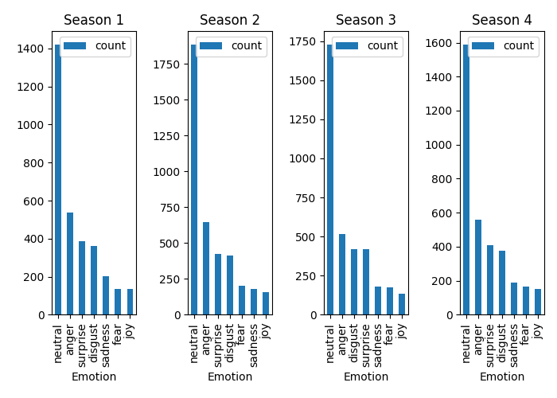
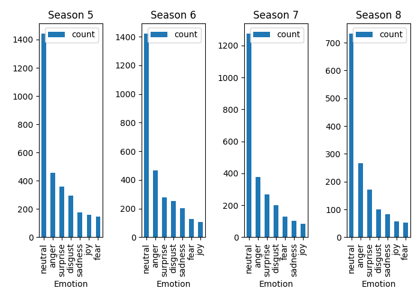
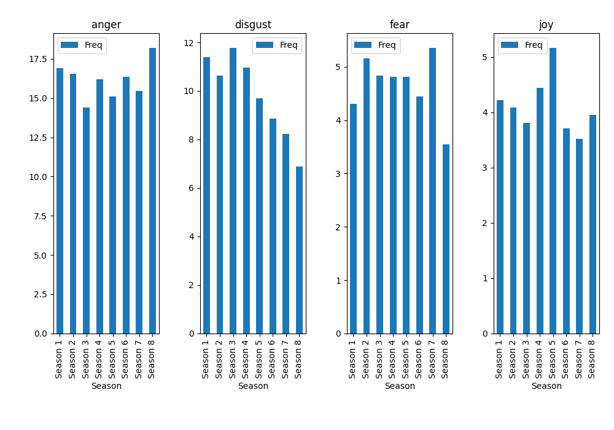
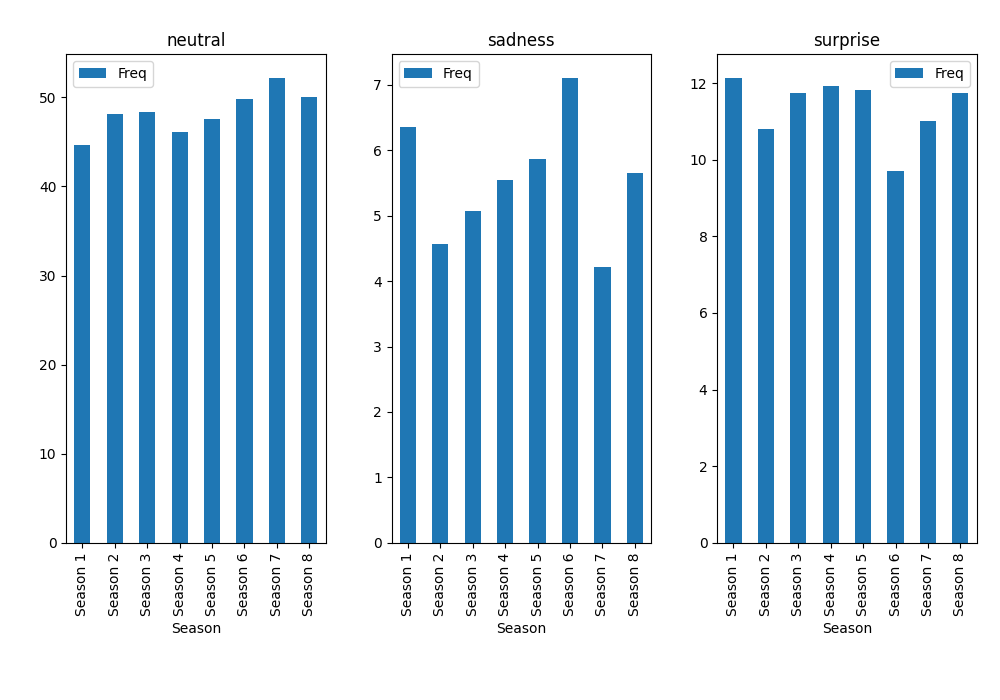

# IMPORTANT
before running any of the code run ../setup/setup.sh to load necessary packages.

# Assignment 4 - Emotion analysis with pretrained language models

Winter is... just finished, actually.

In class this week, we've seen how pretrained language models can be used for a range of tasks. In this assignment, we're going to use these models to perform some computational text analysis of some culturally significant data - scripts from the television show *Game of Thrones*. The scripts have been split into lines, with additional metadata showing who spoke each line, which episode that line comes from, and which season that episode belongs to.

In this assignment, we are going to investigate whether the emotional profile of this show changed over the course of its seven series.

For this assignment, you should write code which does the following:

- Predict emotion scores for all lines in the data
- For each season
    - Plot the distribution of all emotion labels in that season
- For each emotion label
    - Plot the relative frequency of each emotion across all seasons

Finally, your repository should include a writtens summary and interpretation of what you think this analysis might being showing. You do not need to be a media studies expert here - just describe what you see and what that might mean in this context.


## Starter code and data

The data for this assignment can be found in the ```cds-lang-data``` folder on UCloud. The data itself comes from [this website](https://www.kaggle.com/datasets/albenft/game-of-thrones-script-all-seasons?select=Game_of_Thrones_Script.csv).

For this exercise, I recommend using the pretrained emotion classifier that we worked with in class. You can load this via HuggingFace using the following code:

```python
classifier = pipeline("text-classification", 
                      model="j-hartmann/emotion-english-distilroberta-base", 
                      return_all_scores=True)
```                      

## Objective

This assignment is designed to test that you can:

1. Make use of pretrained language models via HuggingFace;
2. Extract meaningful structured information from unstructured text data;
3. Interpret and contextualize these results from a cultural data science perspective.

## Some notes

- You'll need to make use of many of the tools you've learned this semester. This includes - but is not necessarily limited to - libraries such as ```pandas``` and ```matplotlib```.
- You may need to think about how best to present your numbers. Are raw frequencies the best choice? Average? Relative frequencies? That's up to you.

## Additional comments

Your code should include functions that you have written wherever possible. Try to break your code down into smaller self-contained parts, rather than having it as one long set of instructions.

For this assignment, you should submit your code *only* as ```.py``` script, *not* as Jupyter Notebooks.

Lastly, remember to follow the repo structure which was discussed in class recently. The assignment on GitHub provides a schematic outline of how this should look.

###########################################################
# Structure
- data: the folder should have the data. expected default name is Game_of_Thrones_Script.csv
- src: the code
- out: a .csv file with the model extracted predictions for each line, and plots

# Code

## model
The default recommended model was used, with the huggingface pipeline.
https://huggingface-co.translate.goog/j-hartmann/emotion-english-distilroberta-base?_x_tr_sl=en&_x_tr_tl=da&_x_tr_hl=da&_x_tr_pto=sc

The model makes predictions from english language text inputs. It tries to identify which of the 6 base emotions (anger, disgust,fear, (neutral) joy, sadness, surprise) resemble the text most. According to the documentation it was trained on different datasets of emotion classes, and has been used in multiple published scientific papers.

The extract emotion scores() function takes the output of the model, and makes it into a pandas dataframe compatible format. All scores are saved in case further analysis requires that data, but the highest scoring emotion is also noted separately.

The function is run on all lines and the results are appended to the original dataframe. One line was removed because it had no data.

Then the data is wrangled by season and emotion and illustrative plots are made.

## Results

# Seasons



The majority of the lines are marked as "neutral". My intuition is that similar findings would come from any TV script as most lines of dialogue might not have a strong emotional valence, but comparison is needed with other data sources to make any further assessment.

The valenced line suggest Game of Thrones is an angry, surprising and disgusting show.
Season 3 has a bit more disgust, but generally the top 3 are
- Anger
- Surprise
- Disgust
With anger in the definite winner position all throuout.

Joy related lines are the least common, Besides season 5 and 8, where there are slightly less fearful ones. 

I am heavily biased because of my prior knowledge, but I think the hypothesis that it is a show with more drama, and suspense than comedic moments might fit these results.

# emotions




For frequency the percentage of each valenced line / total lines in the season * 100 was used.
mainly to balance for the increased dialogue in season 2.

Anger as mentioned before is quite high all throughout. It seems to fluctuate in the middle but is the highest in both the first and last season. In case this is the main source of conflict and the emotional driving force of the series, it makes sense that the peaks are at the setup and the climax.

Disgust in general shows a diminishing trend. Over the course of the show maybe the emphasis changed. Maybe incorporating disgust in the writing is more worth it in the first half, as it catches viewers, but as they become invested in watching the show it is not as important anymore?

Fear intrestingly peaks at the second and second to last season. In contrast to to anger it could suggest an interesting narrative tool about the theme of revenge, and hierarchical structures turning upside down. Maybe it hints at characters being in a position of power before a shift humbles them and makes them fearful, or vice-verse people down in the mud finally releasing their pent up anger.

Neutral lines slowly increase over time. Maybe as  the show is progressing writing becomes more stale? An often heard critique against long running series, is that they lose their touch and become boring after a while.

Sadness also seems to fit the increased trends in the first and last seasons. All in all these trends suggest that the begginning and end have a special, increased mix of emotions. During the seasons in the middle it shows a rising trend with a climax in season 6. Maybe this is also a genre characteristic of these dramas? That sadness should not peak at the very end, but some redemption has to come before the finale?

Surprise is high and unchanged throuhout. Suspense must be an effective tool for keeping the attention of the viewer at the screen.

