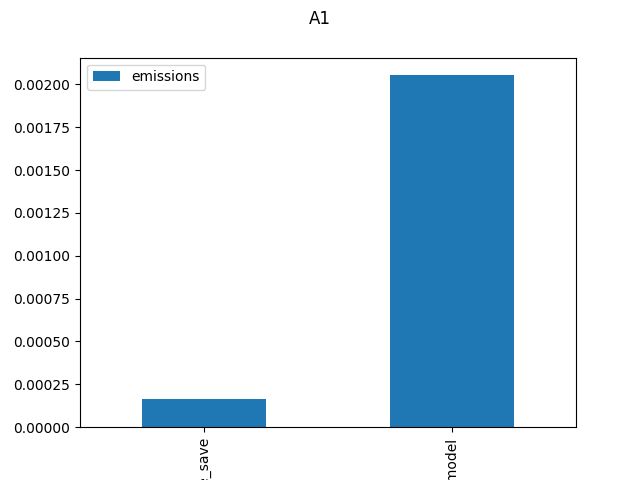
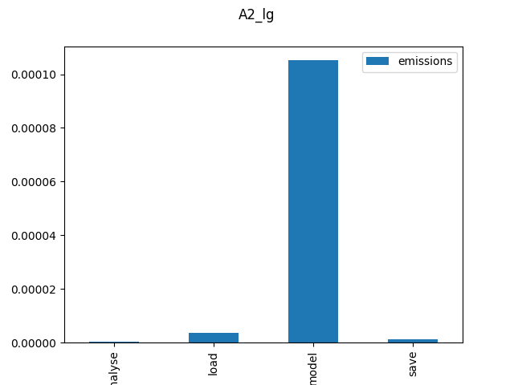
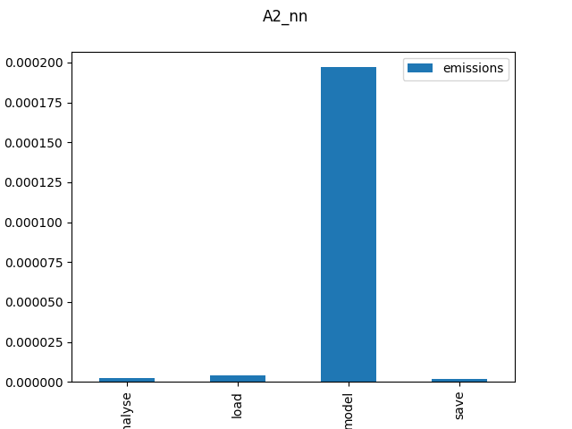
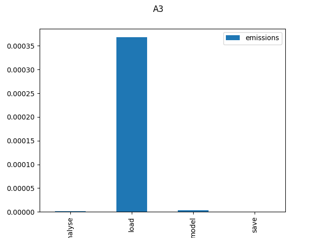
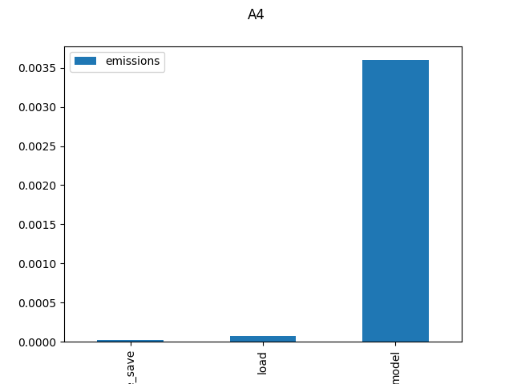
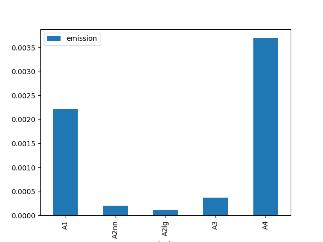

# Assignment 5 - Evaluating environmental impact of your exam portfolio

In the lecture and code along session, we were introduced to CodeCarbon which allows to track the impact of our code in various different ways. The main contribution of this package is that we end up with an approximate value for CO₂ emissions expressed as kilograms of CO₂-equivalent (CO₂eq).

Which leads us to ask - how much of an environmental impact has your work in Cultural Data Science had this semester?

For this assignment, I want you to go back to **all four** of previous assignments in *Language Analytics*. For each assignment, I want you to use CodeCarbone to measure the environmental impact of your code in terms of CO₂eq. You should specifically address the following questions:

- Which assignment generated the most emissions in terms of CO₂eq? Explain why this might be.
- Which specific tasks generated the most emissions in terms of CO₂eq? Again, explain why this might be.
- How robust do you think these results are and how/where might they be improved? 

Your final repository should contain CSV files generated by CodeCarbon, as well as any code used to generate visualizations/plots of the data (see Additional Comments below).

## Starter code and data

All of the relevant code for this assignment is in either your own assignments, the CodeCarbon documentation, or the notebook for today.

## Some notes

- Think carefully about how you want to measure emissions with CodeCarbon. Do you want a single metric for the whole script, or a number of sub-tasks? Make sure to justify your reasons.

## Additional comments

Since the code is already writtten for your previous assignments, it is not necessary to include them in this repository. What is more important are the actual results, along with your interpretation of them. You are free to present these results in whatever way you see fit.

For this assignment - and this assignment **only** - it is therefore acceptable for to submit a notebook which contains the code for generating visualizations from CSV files. However, your notebook **must** be clearly written with adequate documetation and explanatory markdown cells.

## Learning bjectives

This assignment is designed to test that you can:

1. Think critically about the environmental impact of machine learning
2. Write code which provides approximate benchmarks demonstrating this environmental impact
3. Present results in a coherent, clear, and understandable way.

####################################################################

# note
Some assignments were run multiple times while assembling the portfolio, so there are multiple emission data available for them. A average was taken by project_name to ensure only one estimate of emission for every task in every project.

# Assignment1
The tracker is separated into 2 parts. "load_model" and "analyse_save".
- load_model: processing of the data, loading it and running the model. Since the code loads in and runs the model on 1 file at a time, and only saves results, tracking could not be separated further into loading the data and doing operations on it. 
- analyse_save: Creating the outputs, and some plots.
# A1 plots

# Assignment2
Here the code could be separated into 4 different parts for both classifiers:

- load: loading in the data
- model: vectorizing and running the classifier, making predictions
- analyse: creating the confusion matrix and the classification report
- save: saveing putputs

# Assignment2 plots

# Assignment3
The same 4 task structure could be measured here as well.

# Assignment4
As most outputs here were plots, which are easier to immediately save, the analysis and save parts are not clearly distinguishable.

# Discussion

- A1: It is hard to separate this, because either the loading or the modelling is responsible for the majority of the emission, but in this task both ar happening together. I suspect the loading would create more CO2 because of the size of the text corpus, I am not sure.

- A2: Modelling is the clear culprit here for emissions, it shows nicely that with the more advanced Neural network classifier, which had the increased runtime emission also increased.

- A3: Loading the data was the main reason for emissions. It is a huge corpus of spotify data, modelling seems miniscule compared to it. It seems the pre-trained model is lighting fast at finding word cosine distances once it has been loaded.

- A4: Modelling again. Going through all the script and creating the emotion labels took a long time. I had to code a minimalist program bar into that assingment because I had no idead how long it would take. The model architecture is a lot more complex in that assingment than for exemple in the logistic regression classifier of assignment 2.

It makes sense that loading and modeling would require more runtime therefore producing more CO2, than saving the data or making plots about it. Those are larger and more complicated processes, requiring more refined functions. Loading and modelling could also very a lot by the size of the dataset, or the corpus used.

A2 was expected to have lower emissions because of the fairly straightforward models, and A4 was expected to produce the most because of the large data and complex model.
A3 and A1 were surprising.
A3 also uses a large corpus but it seems the GloVe model used was small enough to not raise emissions.
A1 has a large corpus, and also uses a pre-trained model for extracting Parts of speech. Also as it is the first assignment the code might be the least efficient out of all the assignments

All in all Total emission of running these projects is around 0,007kg or around 7grams. A quick google search tells me that it is around the same as smoking half a cigarette. But that is only running them. A lot more hours, computing power and electricity was used in making them.
This was an eye opening approach to something I am used to on a daily basis, not only on the enviromental side, as I am more encouraged to puruse an IT career in countries where electricity is more green, or be extra attentive so my code is efficient, but also just thinking about the various forms of metadata not just used in the analysis, but the metadata that is being produced while making the analyses.

