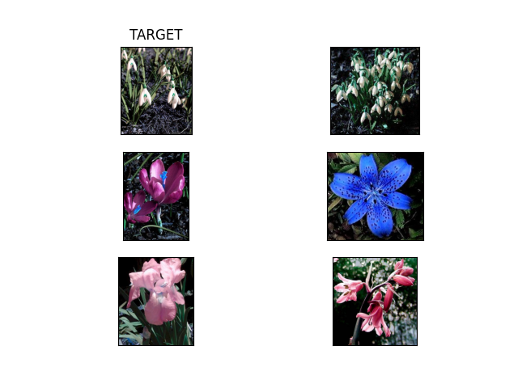
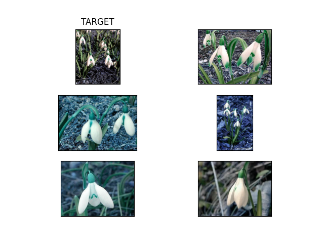

# Building a simple image search algorithm

## IMPORTANT
Before running any of the assignments Please run ../setup/setup.sh in the to ensure the virtual environment with the necessary python libraries is setup

## Assignment Description:
For this assignment, you'll be using ```OpenCV``` to design a simple image search algorithm.

The dataset is a collection of over 1000 images of flowers, sampled from 17 different species. The dataset comes from the Visual Geometry Group at the University of Oxford, and full details of the data can be found [here](https://www.robots.ox.ac.uk/~vgg/data/flowers/17/).

For this exercise, you should write some code which does the following:

- Define a particular image that you want to work with
- For that image
  - Extract the colour histogram using ```OpenCV```
- Extract colour histograms for all of the **other* images in the data
- Compare the histogram of our chosen image to all of the other histograms 
  - For this, use the ```cv2.compareHist()``` function with the ```cv2.HISTCMP_CHISQR``` metric
- Find the five images which are most simlar to the target image
  - Save a CSV file to the folder called ```out```, showing the five most similar images and the distance metric:

|Filename|Distance]
|---|---|
|target|0.0|
|filename1|---|
|filename2|---|

### Objective

This assignment is designed to test that you can:

1. Work with larger datasets of images
2. Extract structured information from image data using ```OpenCV```
3. Quantaitively compare images based on these features, performing *distant viewing*

### Some notes
- You'll need to first ```unzip``` the flowers before you can use the data!

### Additional comments

Your code should include functions that you have written wherever possible. Try to break your code down into smaller self-contained parts, rather than having it as one long set of instructions.

For this assignment, you are welcome to submit your code either as a Jupyter Notebook, or as ```.py``` script. If you do not know how to write ```.py``` scripts, don't worry - we're working towards that!

Lastly, you are welcome to edit this README file to contain whatever information you like. Remember - documentation is important!

## Assignment 1 Documentation

### Contents
    - in: folder with pictures, pictures should be unzipped here with no subfolders
    - out: folder with the output csv of image "similarity". Both based on color histograms and the pretrained model VGG16. Also visual representations in .png format
    - src: assignment_1.py, the code for finding the 5 most similar images to a target image with in a folder full of images.

### Code
   The default image used from the flower dataset is "image_0121.jpg". Additional pictures can be investigated by passing the optional argument --image or -i to running the file like:
   python assignment_1.py -i"other image name"

   The default method is based on color histograms. The script takes each image in the folder and creates color histograms of the images. These are numeric representations based on the amount of pixel values in each color channel of the image. 

   The histograms are normalized with cv2.normalize, using the argument cv2.NORM_MINMAX.
   More about this function: https://docs.opencv.org/3.4/d2/de8/group__core__array.html#ga87eef7ee3970f86906d69a92cbf064bd

   Then it compares the target image to all these and finds the 5 most similar. 
   Comparisons are made with cv2.compareHist using the argument cv2.HISTCMP_CHISQR
   More about this function: https://docs.opencv.org/3.4/d6/dc7/group__imgproc__hist.html#gaf4190090efa5c47cb367cf97a9a519bd

  The names 5 most similar image files are the selected and saved in a .csv file in ../out.
  Image files are also selected.

  Passing the the optional argument --VGG16"1" or -v"1" uses a pre trained model VGG16 to compare the image files. This model was trained on a large image database for classifying images into multiple categories. Using the pre-learned weights of this model, images can be converted into numeric representations, which might be more informative/accurate than using simply image histograms. (the progress bar might be showing 0%, but the script is running)

  The model is imorted with parameters:
  model = VGG16(weights='imagenet', 
              include_top=False,
              pooling='avg',
              input_shape=(224, 224, 3)) 
  
  More about VGG16: https://keras.io/api/applications/vgg/

  In this case images are loaded, reshaped to fit the image size accepted by the model, and made into features.

  Then the script finds the 5 closest image representations in a multi dimensional feature space using their cosine distance, creates a .csv and saves it in ../out. Image files are also selected.
  
  The script uses a nearest neighbor classifier which compares all cosine distances.
  More on this:https://scikit-learn.org/stable/modules/generated/sklearn.neighbors.KNeighborsClassifier.html  

### Results
The resutls here are based on the default image "image_0121.jpg".

Using color histograms:

Using VGG16:

It seems VGG16 was able to find more nuanced details in the images, the pictures selected in that way in my optinion resemple the target more. 

Color histograms is a fairly crude way to understand images, as images are more than colors. Flower shapes, textures etc. are all disregarded in that way. Flowers themselves are not "present" in a color histogram. Background and foreground is disregarded, only colors matter. I think it is not a wild hypothesis therefore, that in the color histogram method, the similar background colours influenced the top 5 similar pictures. In a sense the color histogram method did not find the 5 most similiar "flowers" it found the 5 most similar colorful masses.
