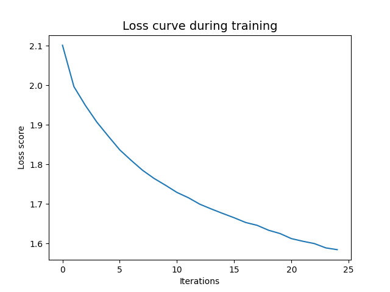

## IMPORTANT
Before running any of the assignments Please run the following sh scripts:
../setup/create_venv.sh to ensure the virtual environment is created
then type source ../Visual_venv/bin/activate into the terminal to activate it
then run ../setup/setup.sh to install necessary libraries

in case ../setup/setup.sh is not working, all the packages used in making the assignments can be found in requirements.txt

# Assignment 2 Instructions
For this assignment, we'll be writing scripts which classify the ```Cifar10``` dataset. You can read more about this dataset [here](https://www.cs.toronto.edu/~kriz/cifar.html)

You should write code which does the following:

- Load the Cifar10 dataset
- Preprocess the data (e.g. greyscale, normalize, reshape)
- Train a classifier on the data
    - A logistic regression classifier *and* a neural network classifier
- Save a classification report
- Save a plot of the loss curve during training
    - UPDATE: This is only possible for the MLP Classifier in scikit-learn

You should write **two scripts** for this assignment one script which does this for a logistic regression classifier **and** one which does it for a neural network classifier. In both cases, you should use the machine learning tools available via ```scikit-learn``` to evaluate model performance.

## Starter code

The data already has a train/test split and can be loaded in the following way:

```python
from tensorflow.keras.datasets import cifar10
(X_train, y_train), (X_test, y_test) = cifar10.load_data()
```

Once you have loaded the data, made it greyscale, and scaled the values then you will need to *reshape* the array to be the correct dimensions - essentially flattening the 2d array like we saw with greyscale histograms. 

You can do that in the following way using ```numpy```:

```python
X_train_scaled.reshape(-1, 1024)
X_test_scaled.reshape(-1, 1024)
```

## Tips
- Make sure to check the different parameters available with, for example, the ```MLPClassifier()``` in ```scikit-learn```. Experiment with different model sizes and parameters.
- The training data comprises 50,000 examples - just be aware that the ```MLPCLassifier()``` can be a little slow!
- The Cifar10 dataset you download does not have explict label names but instead has numbers from 0-9. You'll need to make a list of labels based on the object names - you can find these on the website.
- You should structure your project by having scripts saved in a folder called ```src```, and have a folder called ```out``` where you save the classification reports.

## Purpose

- To ensure that you can use ```scikit-learn``` to build simple benchmark classifiers on image classification data
- To demonstrate that you can build reproducible pipelines for machine learning projects
- To make sure that you can structure repos appropriately

# Assignment 2 Documentation

## Contents

 - out: classification reports in .txt form and learning loss curve for the NN classifier
 - src: 
    - logistic_reg_grey.py, script with a logistic regression classifier for the greyscaled and  
   normalized images
    - neural_network_grey.py, script with a neural network classifier for the greyscaled and normalized images
 - in: As data is downloaded directly in the script, there is no in folder.


## Code
- logistic_reg_grey.py:
the script downloads the cifar 10 dataset split in to training and test sets.
greyscales and normalizes images, because the logistic regression classifier requires a single vector of features, therefore 3 separate color channels are not passable.
The Logistic classifier uses the argument solver ="saga". The documentation specifies this solver is faster for larger data sets, and is good for multiclass problems. tolerance is set to default
More on the classifier:
https://scikit-learn.org/stable/modules/generated/sklearn.linear_model.LogisticRegression.html

The model then predicts labels in the test set and prints a classification report in .txt form.

- neural_network_grey.py:
Essentially the same, except the classifier is an MLP classifier. It is set up with the logistic
sigmoid function to keep it more similar to a simple logistic regression classifier, making comparisons more intuitive. tolerance is left at default, the default solver "adam" is used, according to the documentation it is good for large datasets. According to the documentation with the "adam" solver  max_iter determines epoch size, so it was set to 25. hidden layer size is left at default.
More on the classifier:
https://scikit-learn.org/stable/modules/generated/sklearn.neural_network.MLPClassifier.html#sklearn.neural_network.MLPClassifier
## Results 

Overall scores are better for the neural network classifier. precision, recall and f-scores are around 0.4, compared to the logistic regression classifiers scores, which don't reach 0.3.

These are still not too great results. The Neural network still struggles with some classes, for example the recall for dogs is worse than in case of the logistic classifier. As recall is a measure of true positives divided by true positives and false negatives, this means it has a hard time identfying that class, and labels a lot of the "dogs" as some "other things". The precision in that case got better with the Neural Network, and as precision is the metric of true positives divided by true positives and false positives, this means that the Neural Network classifier labels less "other things" as "dogs". 


The learning curve at epoch 25 is not plateauing yet, although it seems to be approaching that point. Running it for a few more epochs could be improving classifications, but the limitations of using greyscale images, and basically still using picture representations from only pixel color values, a lot more improvement is not expected from a simple Neural Network like this.
