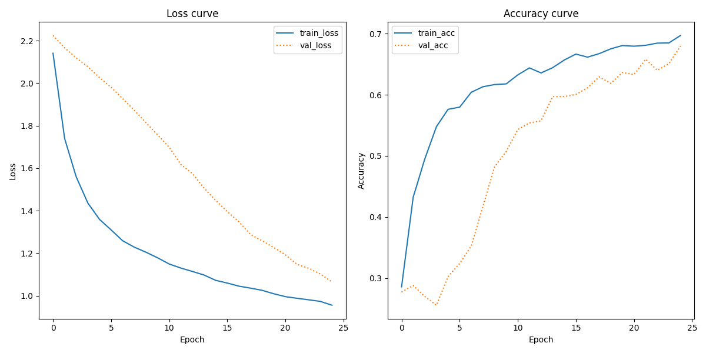

## IMPORTANT
Before running any of the assignments Please run the following sh scripts:
../setup/create_venv.sh to ensure the virtual environment is created
then type source ../Visual_venv/bin/activate into the terminal to activate it
then run ../setup/setup.sh to install necessary libraries

in case ../setup/setup.sh is not working, all the packages used in making the assignments can be found in requirements.txt

# Assignment 3  Description

In Language Analytics so far, we've done lots of document classification based on linguistic features of documents. This week, we are working on a slightly different problem - can we predict what type of document we have based only on its *appearance* rather than its contents?

Think about how different documents look when written on a page. A poem appears differently to a newpaper article, both of which are different from a billboard advertisement. This assignment tries to leverage this knowledge to try to predict what type of document we have, based on its visual appearance.

For this assignment, we'll be working with the *```Tobacco3482```* dataset. You can learn more about this dataset in the original paper which uses it [here](https://dl.acm.org/doi/pdf/10.1145/1148170.1148307). The dataset we are working with is only a small subset of this larger corpus.

You should write code which does the following:

- Loads the *```Tobacco3482```* data and generates labels for each image
- Train a classifier to predict document type based on visual features
- Present a classification report and learning curves for the trained classifier
- Your repository should **also** include a short description of what the classification report and learning curve show.

## Data access

The data for the assignment is available in the shared drive on UCloud. For the purposes of this assignment, you can link to [this version](https://www.kaggle.com/datasets/patrickaudriaz/tobacco3482jpg?resource=download) in your README files.


## Tips
- The images are arranged into folders which have the label name for those images
- The training data comprises 3842 images across 10 different document types. Running code might be quite slow - be sure to plan accordingly.
- You should structure your project by having scripts saved in a folder called ```src```, and have a folder called ```out``` where you save the classification reports.

## Purpose

- To demonstrate that you can use ```tensorflow``` to train Convolutional Neural Networks
- To synthesize existing skills to create pipelines for transfer learning with pretrained CNNs
- To show understanding of how to interpret machine learning outputs

##  Contents
- data : the folder should have the Tobacco document data. The Tobacco folder should have the different document classes in separate folders, the folder names should indicate the class. E.g
in the following structure Tobacco/Adverts, Tobacco/emails, Tobacco/Letter etc....
- src: a3.py the script for the  classification task
- out: a .txt file with the results of the classification report,
a .png with the loss curve for the training ad validation data, as well as an accuracy curve for the training and validation data,
the model in a .keras format.

## Script
### data
The script loads in the data, the data is stored in a list of dictionaries. The dictionaries have the image data normalized by dividing pixel values, and labels, so the the data could be saved and transferred more easily if the need would arise.

The data is extracted from the dictionary, and split into training(80%) and test sets(20%). Splitting is stratified by labels to ensure all labels are present in both sets.

Labels are binarized to work with the model architecture.

### model
The model used is the VGG16 Convolutional Neural Network. Training a model like this takes a long time and a lot of resources, but already existing models, with minor modifications can be utilized for specific tasks. The VGG16 model "learned" a lot about images, and is capable of creating informative numeric image representations through the use of convolutional layers. If the top classifier layer is removed, another can be attached for this specific "assignment3" task.

The classifier is not imported, and the model is frozen. This way the pre-trained model will not update any of the weights originally in the VGG16 model, this classifier will utilize the already learned information. Only the newly added classification Neural Network weights will be trained, which extremely reduces trainable parameters and training time compared to training the whole convolutional Neural Network.

More on the model: https://keras.io/api/applications/vgg/

The new added layers:
- a flattening layer to reduce representation dimensions, so they can be passed to a neural network. 
more: https://keras.io/api/layers/reshaping_layers/flatten/
- a batch normalization layer. Helps model performance, and reduces problems caused by the internal covariate shift.
more: https://keras.io/api/layers/normalization_layers/batch_normalization/
- a layer of 128 nodes with relu activation functions. The relu functions are chosen over the sigmoid, because it takes care of the vanishing gradient problem of the sigmoid activation functions.
- a layer of 10 nodes with softmax activation functions. These are the layers for predicting the 10 classes. The softmax is tailored more for multiclass problems compared to the sigmoid which is used primarily in binary scenarios.

The model optimizer is stochastic gradient descent, with Exponential decay. The SGD is a widely used optimizing method in Machine Learning for finding local minima. The exponential decay means increasingly smaller "steps" in the learning rate. It can increase model performance.

Data augmentation is added to the training set while training. Some pictures get rotated slightly. Generating these additional images can help the model generalize better, as it is not uncommon that documents are not perfectly aligned before scanning, and the model should be able to still recognize the classes. The model uses 10% of the training set for validation during training to check model performance.

It is also important to note, that the VGG16 model was trained on colored pictures, while this dataset consists of black and white images. To deal with this, data is formatted accordingly to how the model expects it, basically the one greyscale color channel is made into 3 different color channels, which have the same values in them.

## Results
### Plots


Loss:
At 25 epochs the training still decreasing, although not too much since epoch 20. The validation loss also seems steadily declining.

Accuracy:
Accuracy is increasing for both validation and training but it shows some oscillation like behavior in the last few epochs compared to the fairly steady increase of the beggining.


A few more epochs might be acceptable as validation and training loss is not deviating from one another, so it is not overfitting to the training yet, but the slowing loss change could mean a plateau is coming soon or maybe already happening. Also the recent "jumps" in validation accuracy, and the slow and small changes in the training accuracy indicate that learning could slow down, therefore the model was not trained for more epochs.

### Classification report

Classification Report

              precision    recall  f1-score   support

        ADVE       0.97      0.85      0.91        46
       Email       0.87      0.91      0.89       120
        Form       0.57      0.65      0.61        86
      Letter       0.68      0.57      0.62       114
        Memo       0.54      0.75      0.63       124
        News       0.78      0.76      0.77        38
        Note       0.83      0.50      0.62        40
      Report       0.47      0.53      0.50        53
      Resume       0.44      0.17      0.24        24
  Scientific       0.39      0.27      0.32        52

    accuracy                           0.66       697
   macro avg       0.66      0.60      0.61       697
weighted avg       0.66      0.66      0.65       697


Visual classification of written documents is an interesting task and this report shows quite well the possible hurdles. 

The model does best in classifing advertisement material which is visually very different from the rest. Adverts have large pictures and fewer text. But it struggles with forms for example. Could be, because these forms can look very different,( some more like plain text, some are tables) in spite of being the same class. Another problem could be the inequality in the data. Stratifying by labels was necessary when separating the data into train and test sets, otherwise some classes might not have made it inot the test set. Here the report shows that the amount of Resumes in the test set was quite smaller than the amount of emails. 
